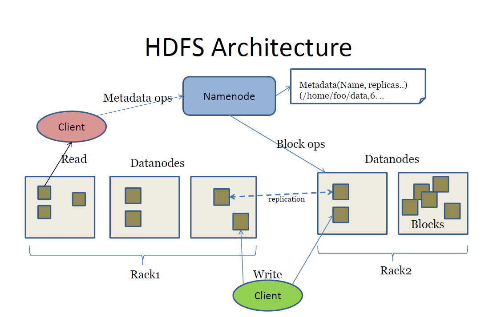

# Зачем нужен HDFS

На мой взгляд, крайне важный инструмент для Data Engineer, позволяющий хранить и обрабатывать огромные объёмы данных.
Работать начал с ним в текущей команде, сразу, как устроился.

Но для старта в роли Data Engineer (Junior / Middle) достаточно усвоить фундаментальные операции и базовую архитектуру, чтобы уверенно работать с HDFS в ежедневных задачах.

**Hadoop Distributed File System (HDFS)** — это распределённая файловая система, заточенная под хранение и обработку больших объёмов данных. В отличие от классических файловых систем, HDFS ориентирован на «разделяй и властвуй»: файлы разбиваются на блоки и хранятся на разных узлах кластера, что повышает масштабируемость и отказоустойчивость.

## Основные плюсы HDFS:

* **Масштабирование**: при росте данных можно просто добавлять новые DataNode.

* **Надёжность**: репликация блоков в разных узлах спасает от потери данных при сбоях.

* **Высокая пропускная способность** при работе с большими файлами (стриминговое чтение).

Поэтому, если в вашей компании или проекте нужно обрабатывать многогигабайтные (а то и петабайтные) датасеты, HDFS становится базисом для других инструментов (Spark, Hive, MapReduce и т.д.).

## Основные компоненты



**NameNode** — «мозг» системы, управляет метаданными (кто, где, что и в каком количестве хранится).

- Не хранит сами данные, а контролирует структуру файлов, расположение блоков.

- В боевых кластерах обычно есть резервный NameNode (Standby) на случай сбоя основного.

**DataNode** — хранит блоки данных. Именно он отвечает за реальное чтение и запись контента.

- При отказе одного DataNode блоки можно прочитать с других, поскольку в HDFS есть механизм репликации.

- Иерархия: NameNode знает, где лежат блоки, а DataNode непосредственно обеспечивают доступ к ним.

## Принцип репликации

Файлы в HDFS обычно делятся на блоки размером 128 МБ (иногда 64 МБ или 256 МБ). Каждый блок хранится с несколькими репликами (по умолчанию — 3) на разных DataNode (часто в разных стойках).

- Это даёт отказоустойчивость: если один DataNode выходит из строя, можно взять блок с другого.

- Ускоряет чтение: можно прочитать данные с ближайшего DataNode или менее загруженного узла.

## Базовые команды HDFS

Для работы с HDFS обычно используют любую командную строку, все команды начинаются с hdfs dfs, то есть мы говорим, что обращаемся к HDFS. 
Ниже основные команды, которые даже можно выписать куда-нибудь.

Я первое время ловил очень сильный рассинхрон от того, что не понимал, в чем разница между локальным хранилищем на рабочей машине и хранилищем HDFS.

### 1. Создание директории

```python
hdfs dfs -mkdir /user/my_folder
```
Создаёт директорию в HDFS. Обратите внимание, что /user/username — классический «домашний каталог» пользователя.

### 2. Загрузка файлов (запись в HDFS)
```python
hdfs dfs -put local_file.txt /user/my_folder/
```
Загружает local_file.txt из локальной файловой системы в директорию /user/my_folder/ на HDFS.

### 3. Просмотр содержимого директории
```python
hdfs dfs -ls /user/my_folder
```
Показывает список файлов внутри HDFS-папки my_folder.

### 4. Просмотр содержимого файла
```python
hdfs dfs -cat /user/my_folder/local_file.txt
```
Выводит содержимое файла в консоли.

### 5. Копирование файлов внутри HDFS

```python
hdfs dfs -cp /user/my_folder/local_file.txt /user/my_folder/archive/local_file_copy.txt
```
Создаёт копию файла внутри самой HDFS, не затрагивая локальную файловую систему.

### 6. Загрузка (чтение) файлов из HDFS на локальный диск
```python
hdfs dfs -get /user/my_folder/local_file.txt ./
```
Скачивает файл из HDFS в текущую локальную директорию.

### 7. Удаление
```python
hdfs dfs -rm /user/my_folder/local_file.txt
```
Удаляет файл из HDFS.

**Внимание**: Эта операция необратима, как и удаление в обычном терминале без корзины.

---

## Пример сценария загрузки и проверки

Допустим, у вас на локальной машине есть data.csv, который нужно загрузить в HDFS:

1. Создаём директорию (при необходимости):
```python
hdfs dfs -mkdir /user/my_data
```
2. Загружаем файл:
```python
hdfs dfs -put data.csv /user/my_data/
```
3. Проверяем, что файл появился:
```python
hdfs dfs -ls /user/my_data
hdfs dfs -cat /user/my_data/data.csv | head -n 5
```
Команда head -n 5 покажет первые 5 строк, чтобы убедиться, что нужный файл залился.

---

Проще всего понабивать руку на проекте на работе, чтобы не разворачивать что-то в Docker у себя на локальной машине дома, тем более не ставить локально.

---


## Вопросы для более глубокого погружения

1. Как HDFS работает при отказе NameNode?
2. Почему в HDFS нет необходимости в RAID?
3. Какие недостатки у механизма репликации HDFS?
4. Что происходит, если запустить hdfs dfs -rm на файл, который в этот момент читается Spark'ом?
5. Что произойдёт, если DataNode выйдет из строя во время записи?
6. Можно ли изменить файл в HDFS?
7. Как происходит балансировка блоков в HDFS?
8. Что будет, если размер блока больше, чем файл?
9. Почему в HDFS используется write-once-read-many модель?
10. Какую проблему может вызвать большое количество маленьких файлов в HDFS?
11. Что делает Secondary NameNode?
12. Как переслать данные между двумя HDFS-кластерами?
13. Почему не стоит хранить файлы в gzip в HDFS?
14. Почему Parquet — лучший формат для HDFS?
15. Какие альтернативы HDFS и чем они лучше/хуже?

Лучше разобрать эти вопросы. Даст вам более глубокое понимание технологии.