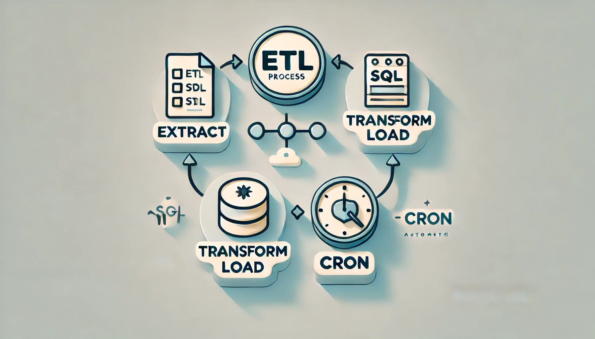

## Как настроить простой ETL-процесс на SQL и cron в PostgreSQL: Руководство для новичков

ETL (Extract, Transform, Load) — это ключевой процесс для обработки данных: он позволяет вытаскивать данные из разных источников, чистить и трансформировать их, а затем загружать в целевую базу данных, чтобы эти данные можно было анализировать. В этом руководстве я покажу, как на практике настроить такой ETL-процесс с помощью SQL в PostgreSQL и автоматизировать его запуск с помощью cron, встроенного планировщика задач в Linux. Это не потребует сложных инструментов вроде Apache Airflow и подойдет для небольших проектов.

---
### Введение

Для начинающего специалиста по Data Engineering освоение SQL и базовых принципов ETL — это просто must-have. Знания по реляционным базам данных, базовым SQL-запросам и навыки автоматизации задач помогают сразу решать практические задачи, а значит, дают возможность уверенно переходить к более сложным процессам в будущем. В этом мини-проекте мы разберем пошагово создание простого ETL-процесса: создадим несколько таблиц в базе данных PostgreSQL, загрузим туда данные, почистим и преобразуем их, а затем настроим автоматическое выполнение задачи через cron.

---
### Почему cron, а не Airflow?

Для простых ETL-процессов cron отлично подходит. Вот его основные плюсы:
- **Простота**: cron встроен в Linux, и чтобы его запустить, не нужно ничего дополнительно настраивать.
- **Минимальные ресурсы**: cron почти не потребляет системные ресурсы, поэтому идеально подходит для небольших задач.
- **Быстрый запуск**: cron запускает задачи мгновенно, поэтому для небольших ETL-процессов с регулярным расписанием это лучший выбор.

Эти преимущества делают cron подходящим решением для обучения и небольших проектов, а когда придет время переходить к более сложным задачам, можно будет осваивать Airflow.

---
### Этапы ETL-процесса: Пошаговое руководство

#### Шаг 1: Создаем таблицы для хранения данных

Начнем с создания нескольких таблиц для хранения информации о транзакциях, продуктах, клиентах и регионах.

```sql
-- Таблица транзакций
CREATE TABLE transactions (
    transaction_id SERIAL PRIMARY KEY,
    product_id INT,
    customer_id INT,
    quantity INT,
    price NUMERIC(10, 2),
    transaction_date DATE
);

-- Таблица продуктов
CREATE TABLE products (
    product_id SERIAL PRIMARY KEY,
    product_name VARCHAR(100),
    category VARCHAR(50)
);

-- Таблица клиентов
CREATE TABLE customers (
    customer_id SERIAL PRIMARY KEY,
    customer_name VARCHAR(100),
    region_id INT
);

-- Таблица регионов
CREATE TABLE regions (
    region_id SERIAL PRIMARY KEY,
    region_name VARCHAR(50)
);
```

#### Шаг 2: Загрузим больше данных для тестирования

Теперь добавим побольше данных, чтобы у нас был более полный набор для ETL-процесса.

```sql
-- Добавляем транзакции
INSERT INTO transactions (product_id, customer_id, quantity, price, transaction_date)
VALUES 
    (1, 1, 2, 25.00, '2024-01-01'), 
    (2, 2, 1, 15.50, '2024-01-02'), 
    (3, 3, 5, 10.00, '2024-01-03'), 
    (4, 4, 3, 5.00, '2024-02-01'),
    (1, 5, 1, 30.00, '2024-02-15'),
    (3, 1, 2, 10.00, '2024-02-20'),
    (2, 3, 4, 15.50, '2024-03-02'),
    (4, 4, 1, 5.00, '2024-04-01'),
    (3, 2, 7, 10.00, '2024-04-05'),
    (1, 5, 3, 25.00, '2024-04-15');

-- Добавляем продукты
INSERT INTO products (product_name, category)
VALUES 
    ('Product A', 'Electronics'), 
    ('Product B', 'Furniture'), 
    ('Product C', 'Books'), 
    ('Product D', 'Toys'),
    ('Product E', 'Clothing');

-- Добавляем клиентов
INSERT INTO customers (customer_name, region_id)
VALUES 
    ('Alice', 1), 
    ('Bob', 2), 
    ('Charlie', 3), 
    ('David', 1),
    ('Eva', 2),
    ('Frank', 3),
    ('Grace', 1);

-- Добавляем регионы
INSERT INTO regions (region_name)
VALUES 
    ('North America'), 
    ('Europe'), 
    ('Asia'),
    ('South America');
```
#### Шаг 3: Очистка данных

На этом шаге удалим дубликаты и проверим, чтобы не было некорректных значений, таких как нулевые количества или цены.

```sql
-- Создаем временную таблицу с очищенными транзакциями
CREATE TEMP TABLE cleaned_transactions AS
SELECT DISTINCT
    t.transaction_id,
    t.product_id,
    t.customer_id,
    t.quantity,
    t.price,
    t.transaction_date
FROM
    transactions t
WHERE
    t.quantity > 0 AND t.price > 0;
```

#### Шаг 4: Трансформация данных

Теперь выполним агрегацию данных, рассчитаем общую сумму продаж и среднюю цену для каждой категории продуктов по регионам.

```sql
-- Создаем временную таблицу с агрегированными данными
CREATE TEMP TABLE transformed_sales AS
SELECT
    r.region_name,
    p.category,
    SUM(ct.quantity * ct.price) AS total_sales_amount,
    AVG(ct.price) AS avg_price,
    COUNT(ct.transaction_id) AS transactions_count
FROM
    cleaned_transactions ct
JOIN
    products p ON ct.product_id = p.product_id
JOIN
    customers c ON ct.customer_id = c.customer_id
JOIN
    regions r ON c.region_id = r.region_id
GROUP BY
    r.region_name, p.category;
```
#### Шаг 5: Загрузка данных в целевую таблицу

Результаты преобразования загрузим в целевую таблицу, чтобы аналитики могли использовать их для построения отчетов.

```sql
-- Создаем целевую таблицу, если она еще не существует
CREATE TABLE IF NOT EXISTS sales_analytics (
    region_name VARCHAR(50),
    category VARCHAR(50),
    total_sales_amount NUMERIC(15, 2),
    avg_price NUMERIC(10, 2),
    transactions_count INT
);

-- Переносим данные из временной таблицы в целевую таблицу
INSERT INTO sales_analytics (region_name, category, total_sales_amount, avg_price, transactions_count)
SELECT
    region_name,
    category,
    total_sales_amount,
    avg_price,
    transactions_count
FROM
    transformed_sales;
```

#### Шаг 6: Настраиваем автоматизацию с помощью cron

Теперь сделаем так, чтобы наш скрипт выполнялся автоматически каждый месяц. Для этого используем cron.

* Откройте cron: в терминале введите crontab -e.
* Настройте расписание: добавьте строку, которая будет запускать SQL-скрипт каждый месяц.

```bash
# Запуск в 2:00 первого числа каждого месяца
0 2 1 * * psql -d your_database -U your_username -f /path/to/etl_script.sql >> /path/to/logfile.log 2>&1
```


---
### Как работает cron?

Cron — это утилита в Linux, которая выполняет команды по расписанию. Настройки cron прописываются в `crontab` (файле конфигурации cron), где указываются дата и время для каждой задачи.

Параметры cron в нашей строке: 0 2 1 * *

- `0` — минута, на которой задача должна выполниться (в нашем случае 0-я минута).
- `2` — час (то есть 2:00).
- `1` — число месяца, на которое задача запланирована (первое число).
- `* *` — каждый месяц и каждый день недели.

Если локальная машина будет выключена в момент, когда задача должна выполниться, **cron не выполнит её позже**. Cron не "догоняет" пропущенные задачи, то есть если компьютер выключен в назначенное время, cron просто пропустит задачу до следующего запланированного запуска. Для критически важных задач рекомендуется настроить cron на сервере или использовать инструменты, которые смогут выполнить задачу при следующем включении машины.

---
### Зачем это нужно начинающим?

Знание SQL и работы с cron дает junior-специалисту ряд полезных навыков:

- **Автоматизация задач**: Во многих проектах важно настроить автоматическое обновление данных, очистку и выгрузку.
- **Практика в SQL**: Практика работы с реляционными базами данных, запросами на выборку, фильтрацией, агрегацией и очисткой данных — это основа анализа.
- **База для работы с продвинутыми инструментами**: После освоения cron переход на Airflow и другие инструменты оркестрации будет гораздо проще.
- **Формирование системного подхода**: Создание автоматизированных процессов развивает умение видеть задачи комплексно, учитывать зависимости и контролировать выполнение шагов.

---
### Дальнейшие шаги


После освоения базовых приемов с SQL и cron можно:

- Попробовать системы оркестрации, такие как Apache Airflow.
- Настроить ETL-процессы на облачных платформах и изучить, как работает автоматизация в облаке.
- Практиковаться с большими объемами данных, оптимизируя SQL-запросы и процессы в целом.

Знания SQL и cron помогают развивать уверенность и понимание, необходимые для решения задач на продакшене и выполнения реальных ETL-процессов.


