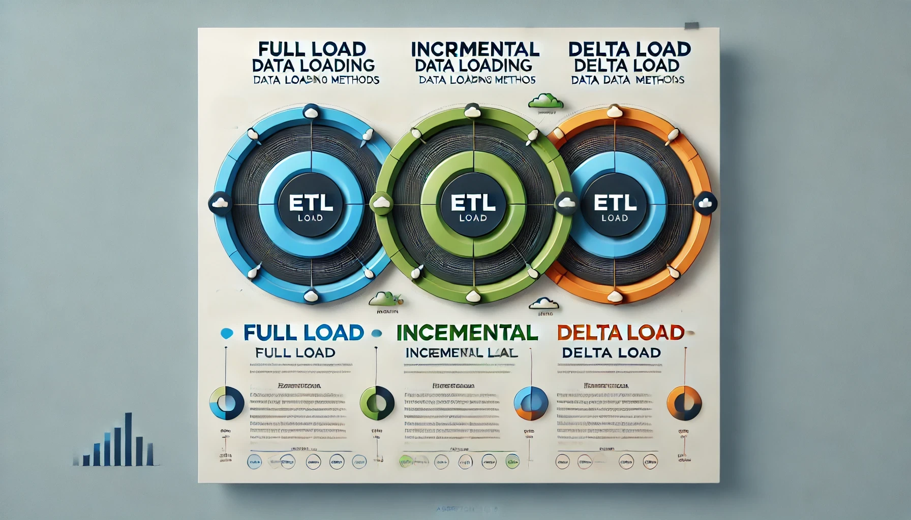

# Варианты загрузки данных в ETL для DWH: различия, плюсы и минусы

При проектировании ETL-процессов для хранилищ данных (DWH) ключевым этапом является выбор подхода к загрузке данных. Именно от этого решения зависят скорость обработки, актуальность данных и стабильность системы. Загрузку данных можно реализовать по-разному, и у каждого метода есть свои преимущества и недостатки.

Итак, давайте разберем, какие виды загрузки данных существуют, для каких систем они подходят, их особенности, плюсы и минусы.

---

## Для каких систем подходят эти подходы?

Методы загрузки данных применимы не только к классическим реляционным базам данных (БД), но и к другим типам хранилищ:

- **Реляционные базы данных (RDBMS)**: MySQL, PostgreSQL, Oracle. Методы загрузки используются для аналитических запросов или репликации данных.
- **Облачные хранилища**: Snowflake, Google BigQuery, Amazon Redshift. Здесь часто используется инкрементальная или delta-загрузка из-за масштабируемости таких платформ.
- **Data Lake**: Хранилища типа Amazon S3, Azure Data Lake или HDFS, где данные сохраняются в формате Parquet, Avro, JSON. Методы загрузки часто включают полную или delta-загрузку.
- **NoSQL-хранилища**: MongoDB, Cassandra. Инкрементальные подходы популярны для хранения неструктурированных или слабо структурированных данных.
- **Потоковые платформы**: Apache Kafka, Apache Pulsar. Здесь используется специализированный подход к delta-загрузке для обработки событий в реальном времени.

Каждый метод загрузки — это универсальный инструмент, который можно адаптировать для разных типов систем в зависимости от их специфики.

---

## 1. Полная загрузка (Full Load)

### Описание
Полная загрузка подразумевает копирование всего объема данных из источника в целевое хранилище. При этом предыдущие данные могут быть удалены или перезаписаны.

### Где применяется?
Полная загрузка лучше всего подходит для систем, где объем данных небольшой или изменения происходят редко:

- Маленькие OLTP-системы.
- Начальная загрузка данных в аналитические системы или Data Lake.
- Резервное копирование всей базы данных.

### Сценарий использования

Например, загружаем таблицу `orders` из OLTP-системы в DWH каждый день, не учитывая изменения.

```sql
TRUNCATE TABLE dwh.orders; -- Удаляем старые данные
INSERT INTO dwh.orders
SELECT * FROM source.orders; -- Загружаем новые данные
```

### Плюсы:
- **Простота**: Подход не требует сложной логики, подходит для начальной загрузки.
- **Целостность данных**: Все данные в целевом хранилище будут полностью соответствовать данным источника.

### Минусы:
- **Большая нагрузка на систему**: Копирование всех данных может перегружать сеть и базу данных, особенно при больших объемах.
- **Длительное время выполнения**: Чем больше данных, тем больше времени требуется на их загрузку.
- **Риск сбоев**: Если процесс не завершился, данные в хранилище будут неполными.

### Когда использовать:
- Маленькие или редко изменяющиеся таблицы.
- Первоначальная загрузка данных при настройке ETL.
- Случаи, когда источник данных не поддерживает механизмы отслеживания изменений.

---

## 2. Инкрементальная загрузка (Incremental Load)

### Описание
Этот подход подразумевает загрузку только новых или измененных данных, начиная с последнего успешного выполнения ETL.

### Где применяется?
Инкрементальная загрузка востребована в следующих системах:

- Облачные хранилища (например, Snowflake, BigQuery), где важна минимизация объема загружаемых данных.
- Реляционные базы данных, где поддерживается поле `last_modified` или Change Data Capture (CDC).
- NoSQL-хранилища, где данные структурированы с отметками времени изменений.

### Пример

Мы хотим загружать только новые заказы или заказы, которые были обновлены после последнего запуска ETL. Для этого используем поле `last_modified`:

```sql
SELECT * 
FROM orders 
WHERE last_modified > '2024-11-25 00:00:00';
```

### Плюсы:
- **Скорость**: Обрабатываются только изменения, что существенно сокращает время загрузки.
- **Экономия ресурсов**: Меньший объем данных снижает нагрузку на систему.
- **Частота обновлений**: Возможность более частого обновления данных в хранилище.

### Минусы:
- **Сложность реализации**: Требуется отслеживать состояние загрузки (например, последнюю временную метку).
- **Риск пропуска изменений**: Например, если запись была обновлена, но поле `last_modified` не было изменено.
- **Требования к источнику**: Наличие механизма отслеживания изменений, например, через `last_modified` или CDC.

### Когда использовать:
- Таблицы с большими объемами данных, где изменения составляют небольшой процент.
- Системы, где важно минимизировать нагрузку на источник данных.
- ETL-процессы с высокой частотой обновлений.

---

## 3. Загрузка с обновлением (Delta Load)

### Описание
Delta Load расширяет инкрементальный подход и включает три операции: добавление новых данных, обновление существующих записей и удаление устаревших данных. Такой подход синхронизирует данные в хранилище с данными источника.

### Где применяется?
Delta Load наиболее подходит для систем, где требуется полная синхронизация:

- Data Lake с поддержкой версии данных, таких как Delta Lake.
- Облачные хранилища (например, Snowflake, Redshift), где изменения должны быть учтены на уровне всех операций.
- Реляционные базы данных, где изменения данных носят комплексный характер.

### Сценарий использования

Например, мы хотим синхронизировать таблицу `orders` между источником и хранилищем. Используем временную таблицу для хранения новых данных, а затем выполняем обновление целевой таблицы.

**Добавление новых записей:**

```sql
INSERT INTO dwh.orders (id, order_date, amount)
SELECT id, order_date, amount
FROM staging_orders
WHERE id NOT IN (SELECT id FROM dwh.orders);
```

**Обновление существующих данных:**

```sql
UPDATE dwh.orders
SET amount = staging_orders.amount
FROM staging_orders
WHERE dwh.orders.id = staging_orders.id
AND dwh.orders.amount <> staging_orders.amount;
```

**Удаление записей (опционально):**

```sql
DELETE FROM dwh.orders
WHERE id NOT IN (SELECT id FROM staging_orders);
```

### Плюсы:
- **Полная синхронизация данных**: Учет всех типов изменений (вставка, обновление, удаление).
- **Минимизация дублирования**: Сохраняется только актуальная версия данных.

### Минусы:
- **Сложность**: Реализация требует более сложной логики.
- **Ресурсоемкость**: Каждая операция (добавление, обновление, удаление) требует ресурсов.

### Когда использовать:
- Системы, где важна полная синхронизация данных между источником и хранилищем.
- Таблицы со средней интенсивностью изменений.

## Сравнительная таблица подходов

| **Характеристика**         | **Полная загрузка**        | **Инкрементальная загрузка**      | **Delta Load**                  |
|-----------------------------|----------------------------|------------------------------------|----------------------------------|
| **Объем данных**            | Большой                   | Малый                             | Малый                           |
| **Сложность реализации**    | Низкая                    | Средняя                           | Высокая                         |
| **Время выполнения**        | Долгое                    | Короткое                          | Среднее                         |
| **Нагрузка на систему**     | Высокая                   | Низкая                            | Средняя                         |
| **Учет изменений**          | Нет                       | Новые и обновленные записи        | Вставка, обновление, удаление   |
| **Когда использовать**      | Маленькие таблицы, инициализация | Большие таблицы, частые изменения | Сложные системы с высокой изменчивостью данных |

---

## Рекомендации по реализации

1. **Автоматизация**  
   Используйте инструменты, такие как Apache Airflow, Prefect или Dagster, для оркестрации ETL-процессов.

2. **Логирование и мониторинг**  
   Внедрите логи на каждом этапе ETL. Это позволит быстро находить и устранять проблемы.

3. **Тестирование**  
   Тестируйте процессы на копии реальных данных. Убедитесь, что ваши процессы корректно работают со всеми типами изменений.

4. **Документация**  
   Фиксируйте логику ETL. Это упростит поддержку процессов в будущем.

---

## Заключение

Правильный подход к загрузке данных зависит от типа системы, объема данных и бизнес-требований. Полная загрузка удобна для простых или начальных задач, инкрементальная загрузка — для частичных изменений, а Delta Load — для сложных синхронизаций. Выбирайте подход, который оптимально решает ваши задачи, и не забывайте о гибридных стратегиях!
