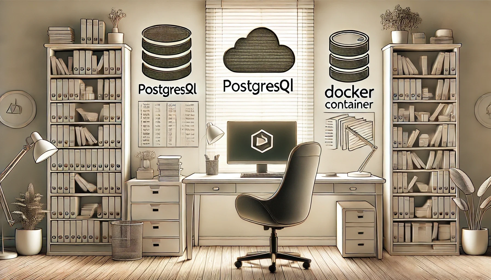

# Не программируйте в вакууме: почему дома стоит поработать с базами данных

Когда я только начинал работать с базами данных, мне казалось, что этого знания хватит: выучил SQL, написал запрос — готово. Но потом пришло понимание, что теория и практика — это две большие разницы. Настоящее погружение начинается, когда ты сам устанавливаешь базу, разбираешь её изнутри и решаешь реальные задачи.

Для этого не нужно сразу бросаться в сложные проекты. Достаточно развернуть базу данных дома и начать с малого. Я попробовал три способа, и каждый из них оказался полезным по-своему.

---

### Локальная установка PostgreSQL

Первый способ — это установить PostgreSQL на свой компьютер. Это самый простой и очевидный шаг, который я выбрал сразу. Ты просто заходишь на [официальный сайт PostgreSQL](https://www.postgresql.org/download/), скачиваешь установщик и запускаешь базу за пару кликов. Всё работает локально, без всяких затрат, и ты получаешь свободу для экспериментов.

Я начал с настройки простой базы и постепенно перешёл к более сложным вещам: пробовал индексацию, партиционирование, писал запросы разной сложности. Это дало уверенность: если ты можешь настроить и управлять базой у себя на компьютере, ты точно справишься с этим на работе.

---

### База данных в облаке

Моё первое знакомство с облачными базами было на курсах **Karpov.courses**. Мы разворачивали базы в облаках **VK Cloud** и **Yandex Cloud**. Это был интересный опыт: там не нужно было устанавливать ничего вручную — просто настроил сервер, и всё работает.

Преимущество облака в том, что база доступна всегда, пока машина запущена. Можно подключаться к ней из любого места, хоть с работы, хоть из кафе. Но за эту магию приходится платить: облачные сервисы берут деньги за время работы серверов.

Тем не менее, я понял, как важно уметь работать с такими системами. Это навыки, которые востребованы в реальных проектах. Да и сам факт, что ты можешь развернуть базу в облаке, добавляет уверенности.

---

### Контейнеризация с Docker

Сейчас я экспериментирую с **Docker**. Это немного другой подход: ты не устанавливаешь базу на компьютер, а разворачиваешь её в контейнере. Фактически, запускаешь миниатюрный сервер прямо у себя.

Самое крутое, что если ты где-то ошибся или что-то пошло не так, достаточно просто пересоздать контейнер. Все изменения отменяются, и база снова работает как новенькая. Это идеально для экспериментов и изучения: нет страха что-то сломать.

Docker ещё полезен тем, что учит тебя работать с командной строкой. Сначала это кажется сложным, но потом понимаешь, что этот инструмент — мощная штука, которая экономит время. Дополнительно вы поймете принцип работы с контейнерами - это разработческое направление, и многие корпоративные приложения работают на этой технологии (в том числе).

Есть довольно неплохой [курс по Docker от Karpov.courses](https://karpov.courses/docker), здесь по полочкам разберут эту страшную вещь.

---

### Немного сравнений методов:

| Характеристика         | PostgreSQL локально      | Облако                 | Docker                   |
|-------------------------|--------------------------|-------------------------|--------------------------|
| **Простота настройки**  | Высокая                 | Средняя                | Средняя                 |
| **Стоимость**           | Бесплатно               | Платно                 | Бесплатно               |
| **Требования к ресурсам**| Минимальные             | Зависит от облака       | Средние                 |
| **Масштабируемость**    | Ограниченная            | Высокая                | Средняя                 |
| **Навыки**              | Базовые                 | Администрирование облака| Работа с CLI            |

### Зачем вообще это нужно?

Работа с базами данных — это больше, чем просто SQL. Нужно понимать, как они устроены, как их администрировать, как работают индексы, оптимизация и партиционирование. Эти навыки важны не только для **Data Engineers**, но и для аналитиков, разработчиков, и всех, кто работает с данными.

Если на работе у вас уже есть задачи с базами данных, это круто — вы можете учиться прямо на практике и не тратить время дома. Но если таких задач нет, домашние эксперименты помогут восполнить пробелы и прокачать вас как специалиста.

---

### Что дальше?

После того как база установлена, можно идти дальше:

1. **Подключить внешние источники данных**  
   Например, подключите файлы CSV, JSON, или используйте API для загрузки данных.

2. **Реализовать этапы ETL**  
   Попробуйте выполнить обработку данных: сначала напишите SQL-запросы для трансформации, а затем изучите Spark или Airflow для автоматизации процессов.

3. **Загрузить данные в BI-инструменты**  
   Выгрузите данные в такие платформы, как Power BI, Tableau или Qlik, чтобы создать наглядные визуализации.

4. **Попробовать продвинутые подходы**  
   Например, настройте репликацию данных или поработайте с кластерными СУБД, такими как Greenplum.

---

Начните с малого - установите базу, разверните её, поэкспериментируйте. Всё это несложно, а результат — крутые навыки, которые откроют перед вами новые возможности.
