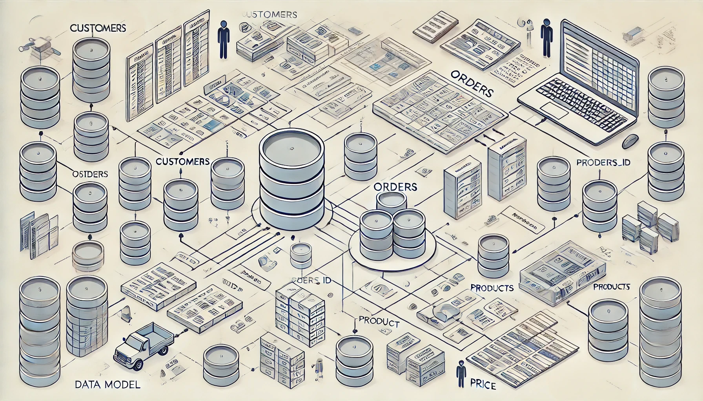

# Понимание реляционной модели данных

В [прошлой статье](sql_for_junior_de.md) мы разбирали несколько практических кейсов, где SQL помогает решать типичные задачи, с которыми сталкивается начинающий Data Engineer. Мы говорили о запросах для анализа клиентской активности, сегментации по расходам и других инструментах для поддержки бизнес-логики. Теперь давайте углубимся в саму основу, на которой строится работа с данными — реляционную модель данных.

Реляционная модель — это тот фундамент, который помогает не просто хранить данные, но и организовать их так, чтобы запросы были логичными, а данные — структурированными и легко доступными для анализа. В этой статье мы пройдемся по ключевым элементам реляционной модели, таким как таблицы, первичные и внешние ключи, а также поговорим о разных видах связей между таблицами. Понимание этих основ даст нам прочную базу для написания более сложных и эффективных SQL-запросов, которые будут востребованы в бизнесе.

Кстати, именно на реляционных СУБД, таких как MySQL, PostgreSQL, Oracle и Microsoft SQL Server, построена работа множества компаний, включая крупных игроков российского рынка. Реляционные базы данных обеспечивают гибкость, целостность данных и возможность масштабирования, что делает их незаменимыми для бизнеса любого масштаба — от стартапов до банков и ритейлеров.

## Основные понятия реляционной модели данных

Реляционная модель данных — это подход к организации данных в виде таблиц, которые связаны между собой с помощью отношений. Она является основой большинства современных систем управления базами данных (СУБД), таких как MySQL, PostgreSQL, Oracle, Microsoft SQL Server и других. В этой статье мы разберем основные понятия реляционной модели, её преимущества и примеры работы.

### Основные понятия реляционной модели данных

Реляционная модель данных была предложена в 1970 году Эдгаром Коддом, который разработал структуру для организации и управления данными на основе математической теории отношений. Модель ориентирована на хранение данных в виде таблиц (или «отношений»), где каждая таблица представляет собой набор данных, а строки и столбцы организуют информацию о сущностях.

1. **Таблица (Relation)**  
   Таблица в реляционной модели — это основная структура данных. Она представляет собой двухмерную матрицу, где строки (или записи) содержат данные о конкретных объектах, а столбцы представляют атрибуты этих объектов. Например, таблица `customers` может содержать данные о клиентах:

   | customer_id | first_name | last_name | email             |
   |-------------|------------|-----------|-------------------|
   | 1           | Alice      | Smith     | alice@example.com |
   | 2           | Bob        | Johnson   | bob@example.com   |

   Каждая строка в таблице уникальна и представляет отдельного клиента, а столбцы описывают характеристики клиентов.

2. **Атрибут (Attribute)**  
   Атрибут — это столбец таблицы, который описывает конкретное свойство данных. Например, атрибуты `first_name`, `last_name` и `email` содержат данные о имени, фамилии и электронной почте клиентов. Атрибуты имеют тип данных, который определяет, какие значения они могут содержать (например, текстовые строки, числа, даты).

3. **Кортеж (Tuple)**  
   Кортеж — это строка таблицы, представляющая собой один набор значений для всех атрибутов. Например, строка `(1, 'Alice', 'Smith', 'alice@example.com')` — это кортеж, содержащий данные о конкретном клиенте.

4. **Первичный ключ (Primary Key)**  
   Первичный ключ — это уникальный идентификатор строки в таблице. Он обеспечивает уникальность каждой записи и используется для однозначного поиска строк. Например, в таблице `customers` поле `customer_id` является первичным ключом, потому что оно уникально для каждого клиента.

5. **Внешний ключ (Foreign Key)**  
   Внешний ключ — это поле, которое используется для создания связи между таблицами. Оно ссылается на первичный ключ другой таблицы, создавая таким образом отношения между данными. Например, таблица `orders` может содержать данные о заказах клиентов и ссылаться на таблицу `customers` через внешний ключ `customer_id`:

   | order_id | customer_id | order_date |
   |----------|-------------|------------|
   | 1        | 1           | 2024-01-01 |
   | 2        | 2           | 2024-01-02 |

## Связи между таблицами

Реляционная модель позволяет связывать таблицы друг с другом, что дает возможность хранить данные в удобном для анализа виде. Основные виды связей:

- **Связь "Один ко многим" (One-to-Many)**  
  Один элемент в одной таблице связан с несколькими элементами в другой. Например, один клиент может делать много заказов. В таблице `orders` поле `customer_id` ссылается на `customer_id` в таблице `customers`, создавая связь "один ко многим".

- **Связь "Многие ко многим" (Many-to-Many)**  
  Один элемент в одной таблице может быть связан с несколькими элементами в другой и наоборот. Например, студенты и курсы: один студент может записаться на несколько курсов, а курс может посещать несколько студентов. Такие связи реализуются с помощью промежуточной таблицы.

- **Связь "Один к одному" (One-to-One)**  
  Один элемент в одной таблице связан с одним элементом в другой таблице. Например, у каждого сотрудника может быть только одна учетная запись в системе. В таком случае данные могут храниться в двух связанных таблицах с использованием одного и того же первичного ключа.

### Пример связи "Один ко многим"

Представим, что у нас есть две таблицы: `customers` и `orders`. Один клиент может разместить несколько заказов. Чтобы создать такую связь, мы добавляем внешний ключ `customer_id` в таблицу `orders`, ссылающийся на `customer_id` в таблице `customers`.

**Таблица customers:**

| customer_id | first_name | last_name | email             |
|-------------|------------|-----------|-------------------|
| 1           | Alice      | Smith     | alice@example.com |
| 2           | Bob        | Johnson   | bob@example.com   |

**Таблица orders:**

| order_id | customer_id | order_date |
|----------|-------------|------------|
| 1        | 1           | 2024-01-01 |
| 2        | 2           | 2024-01-02 |
| 3        | 1           | 2024-01-03 |

Здесь `customer_id` в таблице `orders` указывает, какой клиент сделал заказ.

## Преимущества реляционной модели данных

- **Целостность данных**  
  Благодаря первичным и внешним ключам, реляционная модель обеспечивает целостность данных и предотвращает дублирование.

- **Гибкость**  
  Реляционные СУБД позволяют легко изменять структуру данных, добавляя или изменяя таблицы и связи между ними без значительных изменений в структуре самой базы данных.

- **SQL**  
  Реляционные СУБД используют язык SQL для манипулирования данными, который является стандартом в работе с данными и позволяет легко выполнять запросы.

- **Нормализация**  
  Реляционная модель поощряет нормализацию данных, что позволяет уменьшить избыточность и повысить их логическую целостность.

## Пример работы с реляционной моделью данных

Допустим, мы хотим найти все заказы, сделанные клиентом по имени "Alice". Мы можем выполнить запрос, чтобы связать таблицы `customers` и `orders`, используя внешний ключ `customer_id`:

```sql
SELECT c.first_name, c.last_name, o.order_id, o.order_date
FROM customers c
JOIN orders o ON c.customer_id = o.customer_id
WHERE c.first_name = 'Alice';
```

Этот запрос соединяет таблицы `customers` и `orders` и отбирает заказы для клиента "Alice".

**Результат:**

| first_name | last_name | order_id | order_date |
|------------|-----------|----------|------------|
| Alice      | Smith     | 1        | 2024-01-01 |
| Alice      | Smith     | 3        | 2024-01-03 |

## Применение реляционной модели данных в российских компаниях

Реляционная модель данных широко используется в различных отраслях для эффективного управления и обработки информации. В России многие ведущие компании применяют реляционные системы управления базами данных (СУБД) для поддержки своих бизнес-процессов. Ниже представлены десять крупных российских компаний, активно использующих реляционные СУБД:

- **Сбербанк**: Крупнейший банк России, использующий реляционные базы данных для управления клиентскими данными, транзакциями и аналитикой.
- **Газпром**: Энергетическая компания, применяющая реляционные СУБД для управления данными о добыче, транспортировке и продаже газа.
- **Роснефть**: Нефтяная компания, использующая реляционные базы данных для управления операциями, запасами и финансовыми данными.
- **Лукойл**: Одна из крупнейших нефтяных компаний России, применяющая реляционные СУБД для управления производственными и коммерческими процессами.
- **Яндекс**: Технологическая компания, использующая реляционные базы данных для различных сервисов, включая поиск, рекламу и аналитические платформы.
- **МТС**: Один из ведущих телекоммуникационных операторов, применяющий реляционные СУБД для управления клиентскими данными и биллинговыми системами.
- **ВТБ**: Крупный банк, использующий реляционные базы данных для обработки финансовых операций и управления клиентскими счетами.
- **Магнит**: Одна из крупнейших розничных сетей, применяющая реляционные СУБД для управления товарными запасами, продажами и логистикой.
- **X5 Retail Group**: Крупный ритейлер, использующий реляционные базы данных для управления операциями в сетях "Пятерочка", "Перекресток" и "Карусель".
- **Ростелеком**: Крупнейший провайдер цифровых услуг, применяющий реляционные СУБД для управления сетевой инфраструктурой и клиентскими данными.

Эти компании используют реляционные базы данных для обеспечения надежности, целостности и эффективности обработки больших объемов данных, что критически важно для их операций и предоставления услуг.

## Заключение

Реляционная модель данных — это мощный способ организации и управления данными в СУБД. Она позволяет структурировать данные в виде связанных таблиц, обеспечивая целостность и гибкость хранения информации. Понимание ключевых концепций реляционной модели, таких как таблицы, кортежи, первичные и внешние ключи, связи между таблицами, является важным шагом к эффективной работе с реляционными базами данных и SQL.
